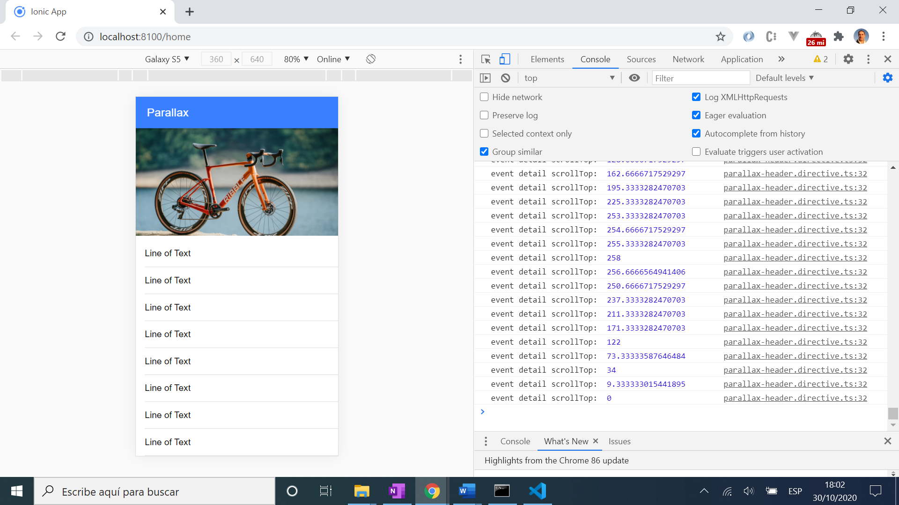

# :zap: Ionic Angular Parallax

* Ionic app to display a parallax effect so scrolling makes an image move out of view slower than the actual content.
* Another great tutorial from [Simon Grimm Youtube: 'Building an Ionic Parallax Image Effect'](https://www.youtube.com/watch?v=TsIVWQf1qNA&t=62s).

## :page_facing_up: Table of contents

* [:zap: Ionic Angular Parallax](#zap-ionic-angular-parallax)
  * [:page_facing_up: Table of contents](#page_facing_up-table-of-contents)
  * [:books: General info](#books-general-info)
  * [:camera: Screenshots](#camera-screenshots)
  * [:signal_strength: Technologies](#signal_strength-technologies)
  * [:floppy_disk: Setup](#floppy_disk-setup)
  * [:computer: Code Examples](#computer-code-examples)
  * [:cool: Features](#cool-features)
  * [:clipboard: Status & To-do list](#clipboard-status--to-do-list)
  * [:clap: Inspiration](#clap-inspiration)
  * [:envelope: Contact](#envelope-contact)

## :books: General info

* [Angular Attribute directive](https://angular.io/guide/attribute-directives) used to contain code to change the appearance of a DOM element.
* [Ionic DomController](https://github.com/ionic-team/ionic-framework/blob/master/angular/src/providers/dom-controller.ts) used with Ion scroll event to read DOM header height and write DOM changes to transform image.

## :camera: Screenshots



## :signal_strength: Technologies

* [Ionic v6](https://ionicframework.com/)
* [Ionic/angular v6](https://www.npmjs.com/package/@ionic/angular) Ionic Angular building blocks
* [Angular v15](https://angular.io/)
* [Ionic Native Splash Screen v5](@ionic-native/splash-screen) plugin to display and hide a splash screen during application launch. Not actually used yet here.

## :floppy_disk: Setup

* npm i to install dependencies
* Type: 'ionic serve' to start the server on _localhost://8100

## :computer: Code Examples

* Extract from `parallax-header.directive.ts` component initialization [lifecycle hook](https://angular.io/guide/lifecycle-hooks) to get an element from the Home page by its class name.

```typescript
ngOnInit() {
    let content = this.element.nativeElement;
    this.header = content.getElementsByClassName("parallax-image")[0];

    this.domCtrl.read(() => {
      this.headerHeight = this.header.clientHeight;
    });
  }
```

## :cool: Features

* Use of very compact code (not mine) to produce array list  `*ngFor="let i of [].constructor(30)"` - see [:clap: Inspiration](#clap-inspiration) below
* [Dom Controller read() and write() functions](https://github.com/ionic-team/ionic-framework/blob/master/angular/src/providers/dom-controller.ts) used so Ionic-Angular schedules read & write operations at the best time. On a related note: DOM updates are better done in batches using the Dom Controller - see [JOSH MORONY blog: Increasing Performance with Efficient DOM Writes in Ionic](https://www.joshmorony.com/increasing-performance-with-efficient-dom-writes-in-ionic-2/) for more on this.
* Use of [webkitTransform translate3d function](https://developer.mozilla.org/en-US/docs/Web/CSS/transform-function/translate3d) to manipulate the image to give the parallax effect.

## :clipboard: Status & To-do list

* Status: Working
* To-do: Nothing

## :clap: Inspiration

* [Simon Grimm Youtube: 'Building an Ionic Parallax Image Effect'](https://www.youtube.com/watch?v=TsIVWQf1qNA&t=62s)
* [Ionic Academy: Building an Ionic Parallax Image Effect [v5]](https://ionicacademy.com/ionic-parallax-image/)
* [Stackoverflow: 'Angular 2 - NgFor using numbers instead collections'](https://stackoverflow.com/questions/36354325/angular-2-ngfor-using-numbers-instead-collections)
* [JOSH MORONY blog: Increasing Performance with Efficient DOM Writes in Ionic](https://www.joshmorony.com/increasing-performance-with-efficient-dom-writes-in-ionic-2/)

## :file_folder: License

* This project is licensed under the terms of the MIT license.

## :envelope: Contact

* Repo created by [ABateman](https://github.com/AndrewJBateman), email: gomezbateman@yahoo.com